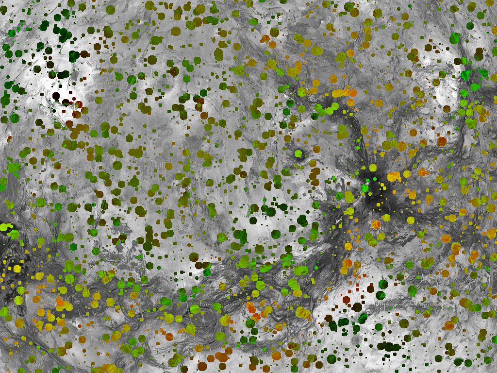
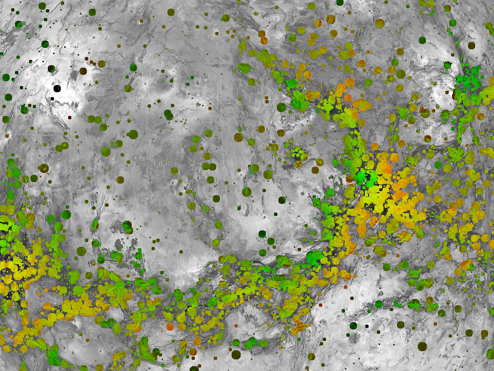

## Antennas Assignment

#### Problem

Given:

- `pop.png` - a population map, from 0.0 to 1.0 (pop.json)
- `cost.png` - a costs map, from 0.0 to 1.0 (cost.json)
- `antennas_and_budget.json` - antennas number and power, cost limit

Find:

- antennas locations

Such as:

- people covered is maximized
- cost is <= budget

#### Generate a solution

    $ python antennas_assignment.py 
    grid: 1024x768
    total_pop: 341540.42
    total_possible_costs: 298744.75
    budget: 1500
    writing solution.json
    people_covered: 72031 (21.09%), cost: 1178.831373
    writing out.png

#### Evaluate a solution

    $ python antennas_assignment.py solution.json 
    grid: 1024x768
    total_pop: 341540.42
    total_possible_costs: 298744.75
    budget: 1500
    people_covered: 72031 (21.09%), cost: 1178.831373
    writing out.png

#### Sample solutions

Random assignment (20% coverage, cost 1176)

Improved assignment (26% coverage, cost 1498)

