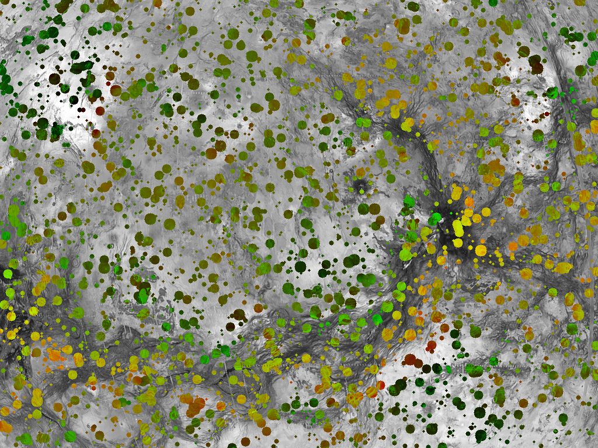
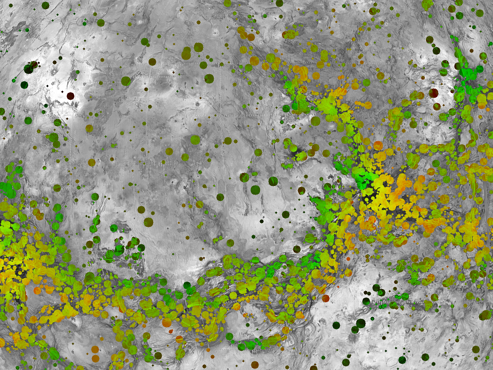
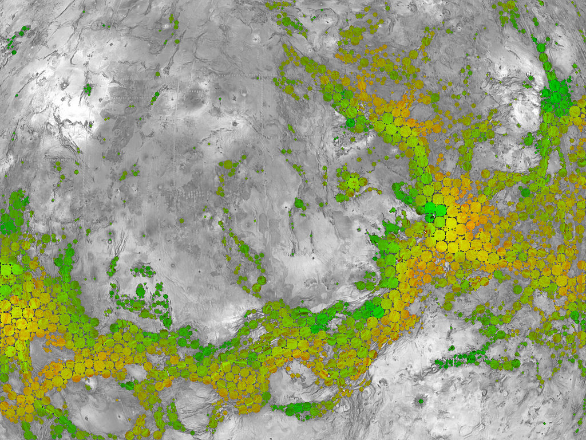

## Antennas Assignment

#### Problem

Given:

- `data/pop.png` - a population map, from 0.0 to 1.0 (pop.json)
- `data/cost.png` - a costs map, from 0.0 to 1.0 (cost.json)
- `data/antennas_and_budget.json` - antennas number and power, cost limit

Find:

- antennas locations

Such as:

- people covered is maximized
- cost is <= budget

#### Generate a solution

	$ python antennas_assignment.py 
	grid: 1024x768
	total_pop: 341540.42
	total_possible_costs: 298744.75
	budget: 1500
	writing solution.json
	people_covered: 76150 (22.30%), cost: 1177.427451
	writing out.png

#### Evaluate a solution

	$ python antennas_assignment.py ../results/solution.json 
	grid: 1024x768
	total_pop: 341540.42
	total_possible_costs: 298744.75
	budget: 1500
	people_covered: 76348 (22.35%), cost: 1193.772549
	writing out.png

#### Sample solutions

Random assignment, named `RANDOM`: 22% coverage, cost 1177

Improved assignment, named `GENETIC`: 28% coverage, cost 1496

Improved assignment, named `OBJC`: 36% coverage, cost 1475

